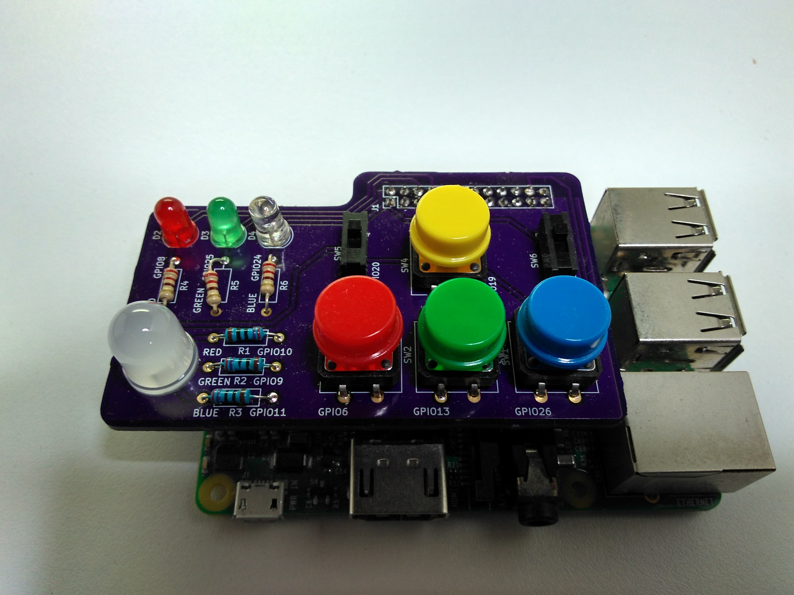
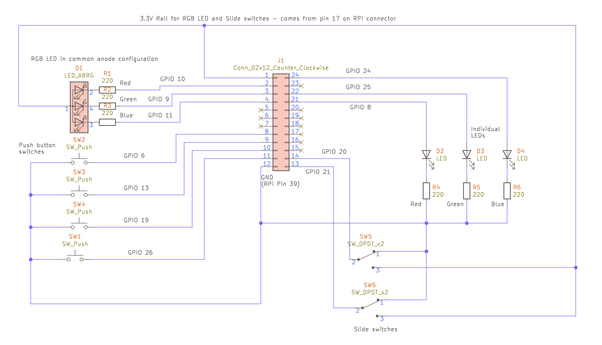

# rpi_led_switch_board

Raspberry Pi LED and switch circuit board



This is a small board that can be fitted on top of the Raspberry Pi GPIO pins. It has the following features;

* 3 individual LEDs
* 1 RGB LED
* 2 slide switches
* 4 push buttons

All of these are separately routed to the Raspberry Pi's GPIO pins through a header so that they can be independently controlled.

Although the board was designed with the Raspberry Pi in mind, there's no reason why it couldn't be used with other similar boards by connecting wires to the relevant header pins.

The board was made as a simple example for learning to use the [Kicad](https://kicad-pcb.org/) circuit board design tools. The design was put together by following [this excellent example from Chris Gammell at Contextual electronics](https://www.youtube.com/watch?v=PlDOnSHkX2c)

The board was fabricated at [Osh Park](https://oshpark.com) and can be viewed [here](https://oshpark.com/shared_projects/ITYO5L7G). 


More details are given below:

# Circuit diagram



The circuit is very basic, it just connects all the components to the header pins. Specifically:

* All push buttons have one side connected to the header (R-Pi GPIO pin) and the other to Ground. 
* The slide switches have 3 pins, one is connected to Ground, one to 3.3V and middle (the slider) goes to the header where it's state can be detected.
* The individual LEDs have their anode (positive, long pin) side connected to the header (GPIO) and their cathode (short pin) to a 220 ohm resistor which goes to Ground.
* The RGB LED is set up as a common anode configuration. This means the positive side of the three LEDs inside it are all connected together and the negative sides come out on three pins. The positive side is connected to 3.3V and the negative sides go through 220 ohm resistors and then to the header (GPIO pins). In common anode configuration the GPIO pins must be set to LOW to turn on the LEDs and HIGH to turn them off. If using the *gpiozero* library *RGBLED* class to control them there is an extra argument needed to setup this. See below and *led_switch_board_demo.py* for examples.

# Controlling using Python on a Raspberry Pi

The circuit board fits onto one end of the GPIO pin header, the end nearest the USB ports (see picture at the top of this page).

The easiest way to control the board is using the [*gpiozero* library](https://gpiozero.readthedocs.io/en/stable/). Set up all the components like this:

```python

from gpiozero import LED,RGBLED,Button
from signal import pause

# Setup the hardware
# =======================

# Individual LEDs
led_red = LED(8)
led_green = LED(25)
led_blue = LED(24)

# Red, Green, Blue (RGB) LED
# Note: need to set the active_high argument to False
led_rgb = RGBLED(red=10,green=9,blue=11,active_high=False)

# Push buttons
button_red = Button(6)
button_green = Button(13)
button_blue = Button(26)
button_yellow = Button(19)

# Slide switches
switch_left = Button(20)
switch_right = Button(21)

```

From here you can use all the functions as described in the *gpiozero* Basic recipes.

```python

# Turn on LED
led_red.on()

# Turn off LED
led_blue.off()

# Set colour on RGB LED
led_rgb.color = (0, 1, 0)  # full green
led_rgb.color = (1, 0, 1)  # magenta
led_rgb.color = (1, 1, 0)  # yellow
led_rgb.color = (0, 1, 1)  # cyan
led_rgb.color = (1, 1, 1)  # white

# Check if button pressed
if button_red.is_pressed:
        print("Red Button is pressed")

# Same for switches
if switch_right.is_pressed:
        print("Right Switch is on")

```


